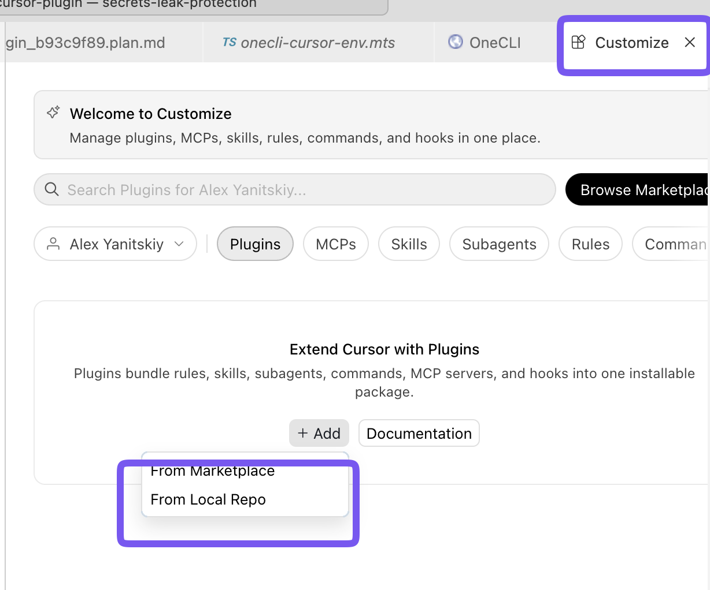
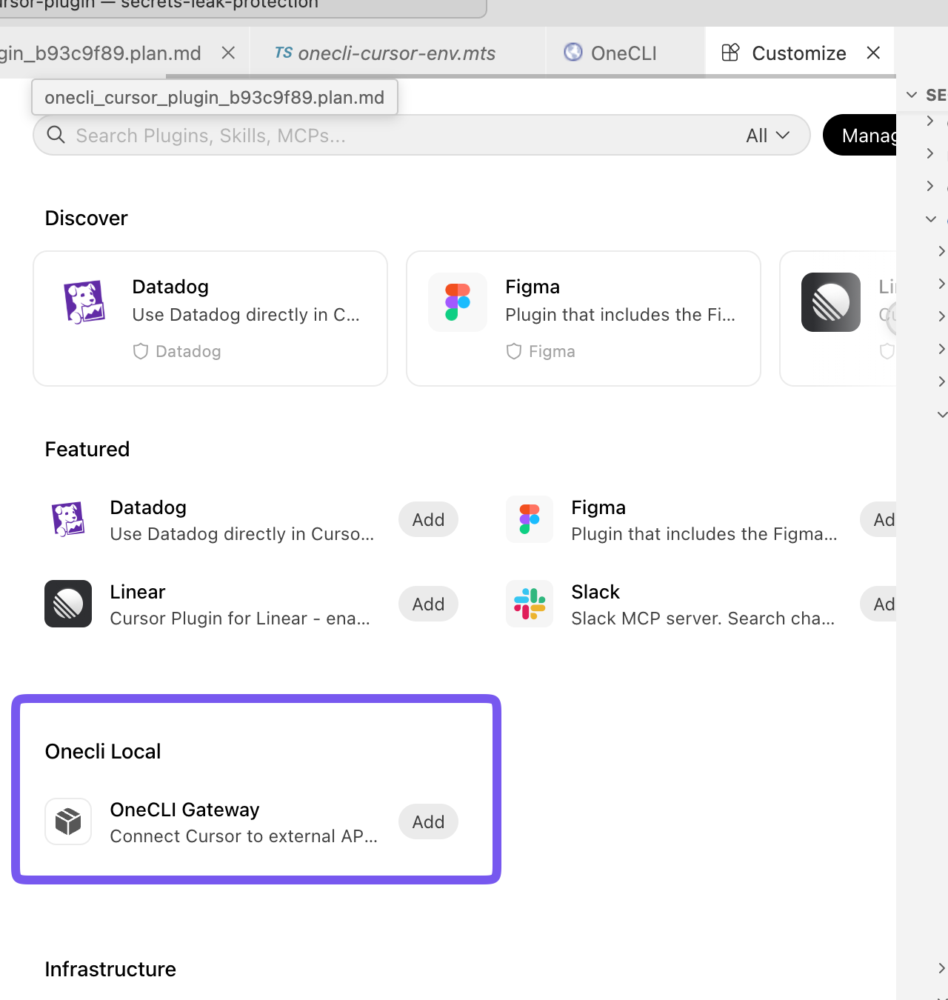
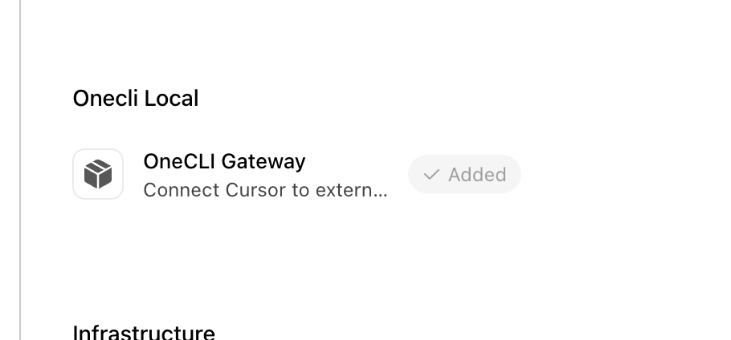
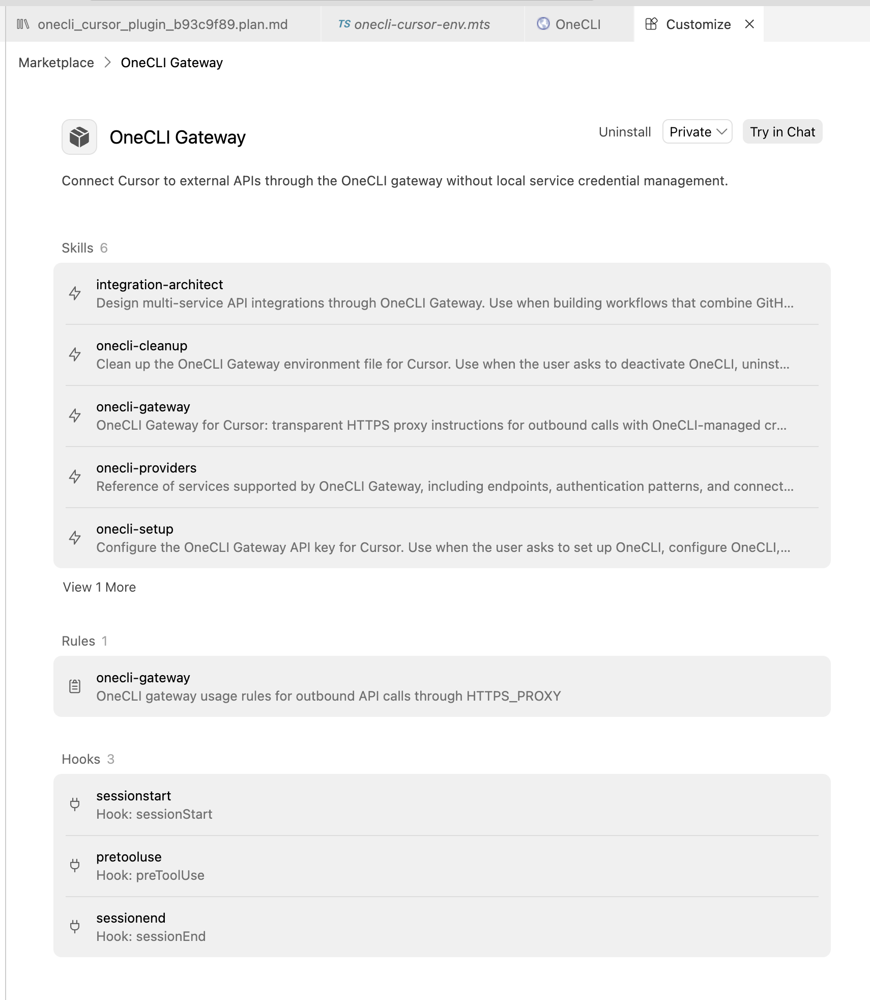
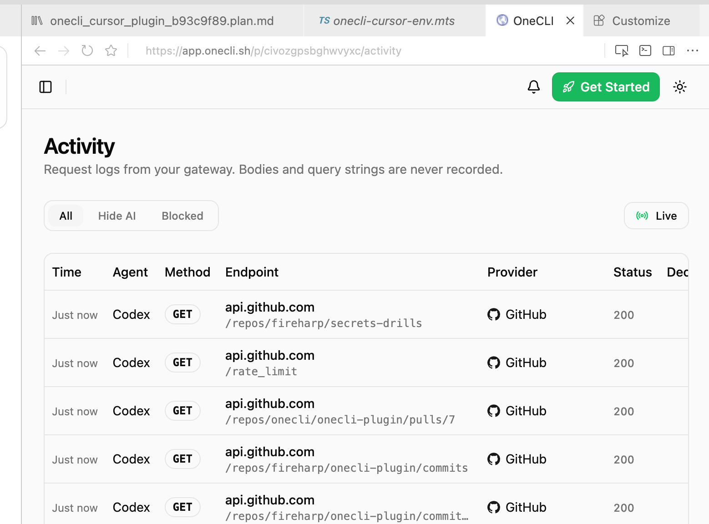

# Cursor setup guide (with screenshots)

Visual walkthrough for installing and verifying the OneCLI Gateway plugin in Cursor.

## Prerequisites

- OneCLI API key configured (`onecli-setup` skill or `~/.onecli/credentials/api-key`)
- Node.js 18+ (for hook scripts)
- Built plugin artifacts:

```bash
npm install
npm run build
```

## Step 1 — Open Customize and add from local repo

1. Click **Customize** in the Cursor sidebar.
2. Open the **Plugins** tab.
3. Click **+ Add** → **From Local Repo**.
4. Select the `plugins/cursor` folder (must contain `.cursor-plugin/marketplace.json`).



## Step 2 — Install from the local marketplace

Under **Onecli Local**, click **Add** on **OneCLI Gateway**.



After install, the plugin shows **✓ Added**.



## Step 3 — Enable third-party extensibility

In **Cursor Settings → Features**, enable:

**Include third-party Plugins, Skills, and other configs**

Without this, plugin hooks may not register (skills and rules can still load).

## Step 4 — Reload and start a new Agent session

- `Cmd+Shift+P` → **Developer: Reload Window**
- Open a **new** Agent composer chat (triggers `sessionStart`)

## Step 5 — Confirm plugin contents

Open the installed **OneCLI Gateway** plugin detail page. You should see:

| Component | Count | Purpose |
| --------- | ----- | ------- |
| Skills | 6 | Setup, status, gateway usage, providers, integrations, cleanup |
| Rules | 1 | Always-on outbound API guidance via `HTTPS_PROXY` |
| Hooks | 3 | `sessionStart`, `preToolUse` (Shell), `sessionEnd` |



Also check **Settings → Hooks** for the three hook entries.

## Step 6 — Verify gateway routing

### Automated check

```bash
python3.12 tests/verify_cursor_agent_gateway.py
```

**Gateway active:** `core_limit` ≈ `11400`, `ok: true`  
**Direct / hooks missing:** `core_limit: 60`

### Manual check (subagent-safe)

Ask an Agent to run only:

```bash
curl -s https://api.github.com/rate_limit | python3 -c "import json,sys; print(json.load(sys.stdin)['resources']['core']['limit'])"
```

`HTTPS_PROXY` stays unset in the shell — the `preToolUse` hook rewrites each Shell command to auto-source `~/.onecli/env.sh`.

### Dashboard Activity

Open your OneCLI project **Activity** tab. Successful gateway traffic appears as `GET api.github.com/...` rows with HTTP 200.



> **Note:** Requests may be labeled with your project's default agent name (e.g. "Codex") — that is expected and does not mean the wrong plugin is running.

## Project-level hooks fallback

If plugin hooks do not appear after install (known Cursor bug), run from your workspace root:

```bash
./onecli-plugin/plugins/cursor/scripts/install-project-hooks.sh .
```

This writes `.cursor/hooks.json` pointing at the built hook scripts.

## Example subagent verification prompt

```
Use the OneCLI Gateway plugin in one concrete, useful way that shows why it's valuable in this workspace.
```

A successful run fetches GitHub API data via plain `curl` (no manual proxy setup) and returns `rate_limit` `core.limit` > 1000.
